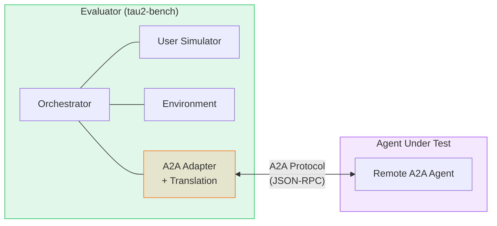
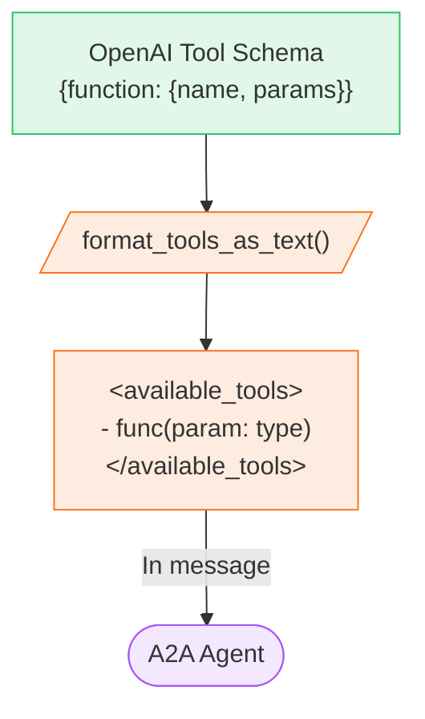
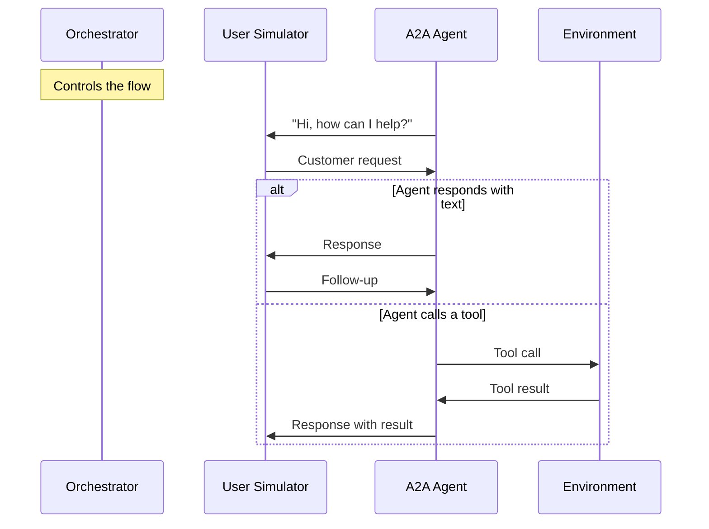
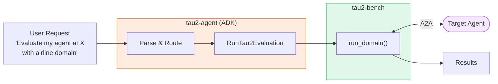
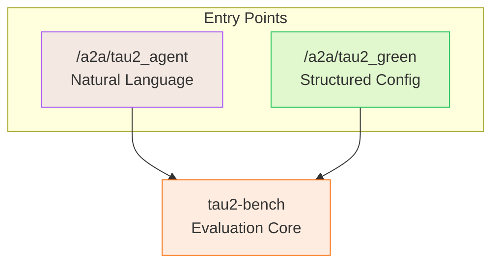
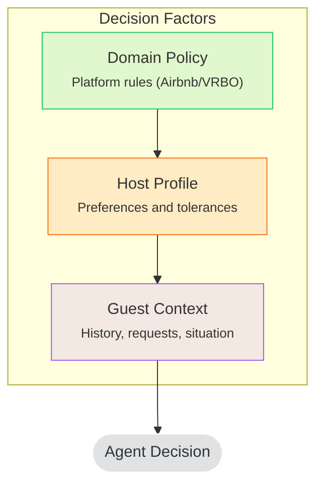
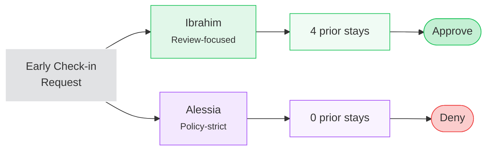

## What is AgentBeats?

AgentBeats envisions a more streamlined and accessible agentic evaluation platform where benchmarks themselves are agents that can evaluate other agents. You can read more about the platform on their [competition page](https://agentx.com/agentbeats) and their [developer documentation](https://docs.agentbeats.dev).

The platform uses a two-agent model. A Green Agent (evaluator) runs benchmarks, and a Purple Agent (evaluatee) gets tested. They communicate over A2A protocol.

This project was developed as part of UC Berkeley's MOOC Agentic AI course's AgentBeats competition, specifically for Sierra's Custom Track.

## Why Tau2 Bench?

I chose to agentify tau2-bench because it's a widely adopted benchmark for conversational agents, and working with it would deepen my understanding of how these agents are evaluated.

## How A2A Evaluation Works

The evaluator simulates customers, manages the environment, and scores responses.



The A2A Adapter (with translation) sits inside the evaluator. It converts tau2's internal messages to A2A format before sending, and parses responses back.

Your agent can't use its own tools. It receives tool descriptions as plain text and has to format calls as JSON in its response.

## The Tool Passing Mechanism

In native tau2, the agent receives structured OpenAI function schemas:

```python
# Native: tools passed as structured schemas
response = llm.chat.completions.create(
    model="gpt-4",
    messages=messages,
    tools=[{"type": "function", "function": {...}}]
)
```

For A2A agents, those schemas get converted to text and injected into the first message.



The agent sees something like this on the first turn:

```xml
<instructions>
You are a customer service agent. In each turn you can either:
- Send a message to the user
- Make a tool call
You cannot do both at the same time.
</instructions>

<policy>
[Domain-specific rules injected here]
</policy>

<available_tools>
- get_reservation_details(confirmation_number: string)
  Description: Retrieve reservation by confirmation number
  Parameters:
    - confirmation_number (string, required)

- cancel_reservation(confirmation_number: string, reason: string)
  Description: Cancel an existing reservation
</available_tools>

To use a tool, respond with JSON:
{"tool_call": {"name": "tool_name", "arguments": {...}}}
```

Then it has to produce valid JSON in its response:

```json
{
  "tool_call": {
    "name": "get_reservation_details",
    "arguments": {
      "confirmation_number": "ABC123"
    }
  }
}
```



The Orchestrator passes messages between participants. When the agent makes a tool call, it goes to the Environment, and the result comes back to the agent (not through the User Simulator).

Tool results also come back as text:

```
Tool result (id=abc-123): {
  "status": "confirmed",
  "guest": "John Doe",
  "check_in": "2024-03-15"
}
```

## Agentifying Tau2 Bench

AgentBeats provided Tau2 Bench as the example agentified benchmark for all submissions to reference. There was some delay in them announcing this and providing the code, so my initial implementation took a different approach.

### A2A and ADK

Using A2A as the basis for agent communication was required, but I also chose Google's Agent Development Kit (ADK) to assist with structured agent and tool definitions. ADK integrates well with A2A and provides convenience methods to make any ADK agent A2A-compatible.

My approach was to create tau2-agent using ADK's LLMAgent, equipping it with tools to administer tau2-bench evaluations. This enables natural-language evaluation requests such as "Evaluate my agent at `<agent_endpoint>` with the airline domain using 5 tasks and 2 trials." Under the hood, tau2-agent wraps tau2's `run_domain` function, parsing the request and passing the target agent's A2A endpoint to tau2-bench. As a result, the end user can evaluate their agent through a familiar conversational interface.



### AgentBeats Integration

AgentBeats' architecture favors structured inputs, outputs, and config-based requests. While my natural-language interface worked well standalone, integrating it with the platform required adaptation. To support both interaction modes, I added a separate route that follows AgentBeats' structured format while preserving the original natural-language endpoint. 



This dual-interface approach lets users choose between conversational evaluation requests or direct config-based requests.

## LLM Headaches

I tested multiple models for both my wrapper agent and tau2's user simulator before settling on Qwen3. Nebius generously provided participants with $50 of credit, which allowed me to experiment with several models including Kimi-K2-Thinking, Llama 3.1-8B, Gemini 2 Flash, and Qwen3-Coder.

The main challenge was inconsistent tool-calling behavior. Each model handled tool calls differently, and there was no clear documentation explaining these differences. This led to many debugging loops trying to figure out why tau2 evaluations were failing. Often the issue wasn't my code but unexpected model behavior.

Qwen3-30B and Qwen3-235B Thinking proved the most reliable in my testing, with consistent tool-calling and instruction-following at reasonable cost. The main tau2 repository defaults to GPT-4+ for both the agent and user simulator, so the benchmark may be better tuned for larger foundation models.

## Expanding Tau2 Bench: Vacation Rental Domain

I also wanted to create a new domain. Existing tau2 domains test basic tool calling, context retrieval, and policy compliance. A new domain that only changes the topic (retail instead of airline) would test the same behaviors with different labels.



I built a Vacation Rental domain that introduces host profiles. Agents must follow domain policy (Airbnb/VRBO rules) while also acting on behalf of host preferences.

The host profile tests how well agents can replicate host psychology. Some hosts prioritize reviews over revenue. Others apply policy strictly. Same guest request, different host, different correct answer.

Example: A guest asks for early check-in.

| Host | Profile | Decision |
|------|---------|----------|
| Ibrahim | Prioritizes reviews, flexible with repeat guests | Approves (guest has 4 prior stays) |
| Alessia | Strict policy adherence, low risk tolerance | Denies (no history with this host) |

An agent that always approves fails the Alessia case. An agent that always denies fails Ibrahim. The only way to pass both is to actually check guest history and host preferences.



This creates 35 tasks across 8 listings and 3 host archetypes. The domain adds a preference layer that makes identical scenarios produce different correct answers.

## Implementation Details

For those who want to run this yourself, here's the quick start:

```bash
# Evaluate an A2A agent
tau2 run airline \
  --agent a2a_agent \
  --agent-a2a-endpoint http://localhost:8080 \
  --agent-a2a-timeout 300

# With authentication
tau2 run airline \
  --agent a2a_agent \
  --agent-a2a-endpoint http://localhost:8080 \
  --agent-a2a-auth-token $MY_TOKEN

# Debug mode for A2A protocol logging
tau2 run airline \
  --agent a2a_agent \
  --agent-a2a-endpoint http://localhost:8080 \
  --a2a-debug
```

The A2A integration lives in `src/tau2/a2a/`. Key files:

| File | Purpose |
|------|---------|
| `client.py` | HTTP client for JSON-RPC communication |
| `translation.py` | Converts between tau2 and A2A message formats |
| `models.py` | Config, state, and response data structures |

## Takeaways

Tool-calling consistency varied significantly across models and wasn't predictable from general capability. For benchmark design, new domains should introduce behavioral complexity rather than topical variation.

## Code References

- [Sierra Tau2 Bench](https://github.com/sierra-research/tau2-bench)
- [Tau2 Bench Agent](https://github.com/wuTims/tau2-bench-agent)
- [Tau2 Bench Agent Leaderboard](https://agentbeats.dev/leaderboard/tau2)