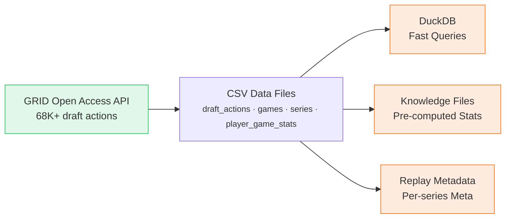
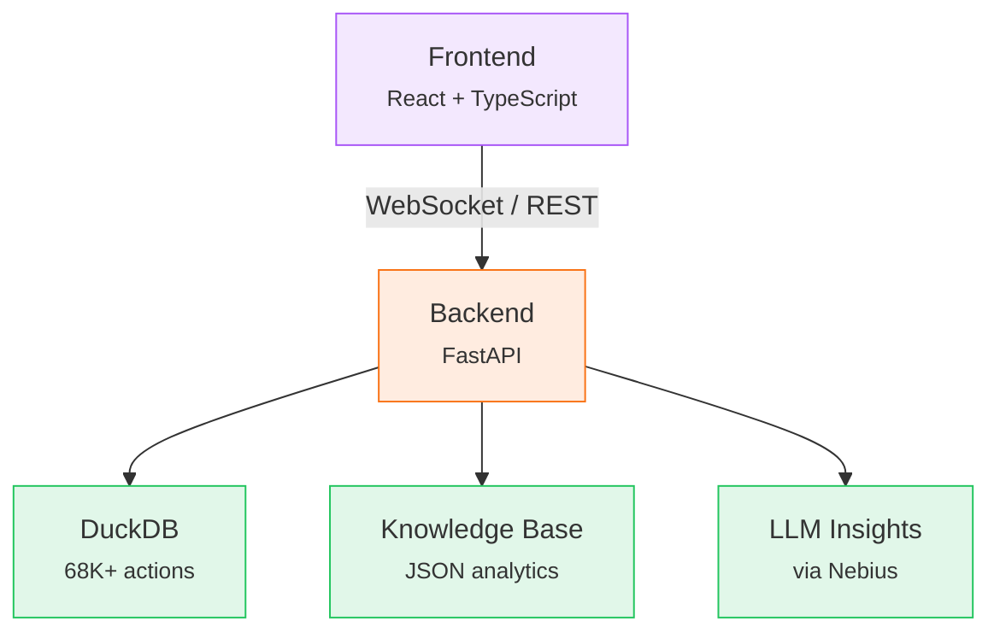
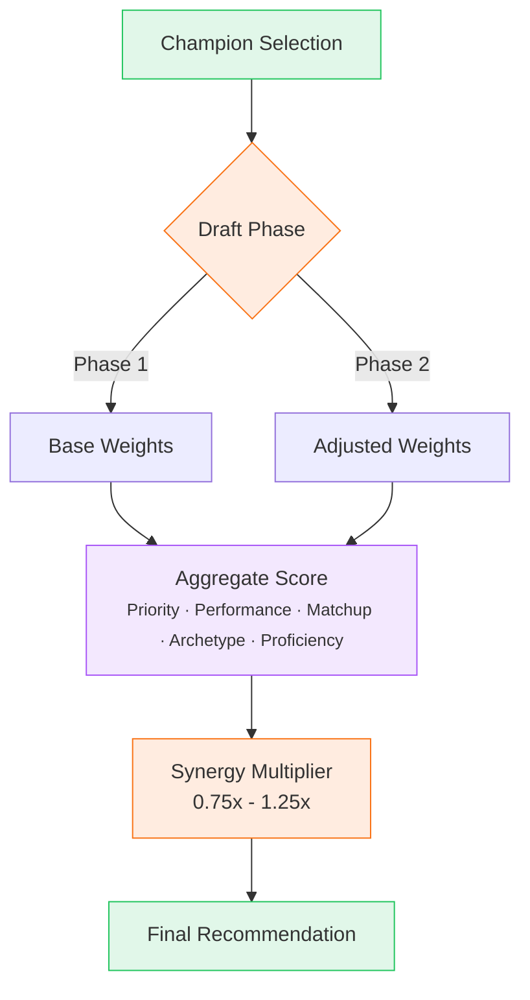
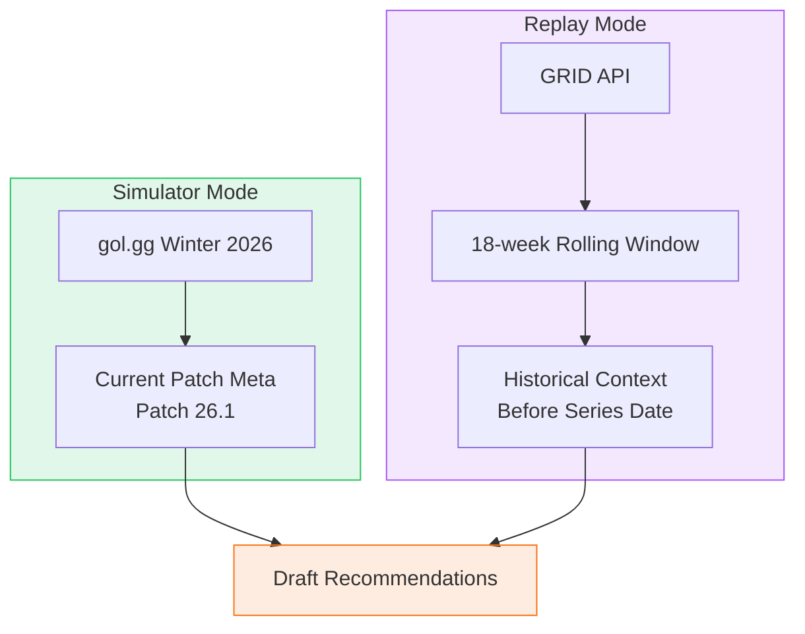

<iframe width="560" height="315" src="https://www.youtube.com/embed/d4AkBmlKqYY?si=1" title="YouTube video player" frameborder="0" allow="accelerometer; autoplay; clipboard-write; encrypted-media; gyroscope; picture-in-picture; web-share" referrerpolicy="strict-origin-when-cross-origin" allowfullscreen></iframe>

Everyone knows that Teemo should always be banned. Unfortunately, professional LoL data doesn't reflect this. So, we decided to build an intelligent draft assistant backed by real professional data.

## The Problem

League of Legends draft phase is complex. Teams need to consider meta strength, player comfort, lane matchups, team composition synergies, and opponent tendencies. Professional teams have dedicated analysts and coaches, but even they under-analyze key draft states.

Ban-Teemo is a data driven draft recommendation system that combines data analysis with powerful LLM reasoning. Instead of embarking on a lengthy model training journey, we thought to create a recommendation system using the GRID API data and other external sources. We could then use the scoring system and prompt an LLM with additional drafting decision logic to get more in-depth contextual insights.

## The Foundation

From the beginning, we agreed that the recommendation engine was foundational to the application, so we had to design it well. We started off experimenting and analyzing the GRID API and datasets to see how we use it to craft a scoring system. We initially designed a layered analysis approach where each layer would analyze different sets of data to produce a score. At the end, we would aggregate the scores and weight them by their importance in draft decision making.

The system analyzes 68,000+ draft actions from professional matches across LCK, LEC, LCS, and LPL. Our data pipeline looks like this:

After the initial design was complete, we broke it down into a data processing pipeline, setup core database service, core backend API service, and frontend components. We defined how each layer interacted with each other and clearly outlined frontend-backend-database communication. It was also important to design the underlying data models based on the data fetched from GRID API.

## Building It

We setup our monorepo, Python/Fastapi backend with React/Vite frontend, in Intellij Ultimate. We then setup Run Configurations to easily test, debug, and deploy our services. Since we also setup a Makefile, we could easily setup these run configs by just hooking up the right make script call.

The architecture separates concerns cleanly:

We used Claude Code with skills such as Superpowers and frontend-design to iteratively improve our initial design, break each feature into tasks, and implement. Once the initial design was implemented, we ran manual tests and created evaluation scripts to simulate games and analyze the scores. With the manual feedback loop and evaluation scripts, we were able to surface and address some of the data issues.

## The Scoring System

Pick recommendations use a multi-factor approach with phase-aware weighting:

| Component | Weight | Description |
|-----------|--------|-------------|
| Tournament Priority | 25% | How often pros contest this champion |
| Tournament Performance | 20% | Role-specific adjusted win rate |
| Matchup/Counter | 25% | Combined lane + team matchup advantage |
| Archetype | 15% | Team composition fit |
| Proficiency | 15% | Player comfort level |

Synergy is applied as a multiplier (0.75x to 1.25x) rather than an additive component. This prevents weak picks from being "rescued" by good synergy.

Ban recommendations use a tiered priority system. Phase 1 targets signature power picks (high meta + high proficiency), meta power picks, or comfort picks. Phase 2 shifts to countering the opponent's composition and limiting their champion pool.

## Data Issues

League of Legends has frequent patches and a constantly shifting meta game. We didn't realize until later in the development, that we needed to more clearly separate the meta-analysis from the player and team-based analysis. The original meta-analysis combined all historical data and only updated the scoring weights based on patch numbers. We updated this to analyze the most recent tournaments and used that as our foundational data on meta champions and picks/bans.

By nature, because the meta is constantly changing, there will never be significant data across all lane matchups/champions for a given time frame. We would need to supplement champion related data with either custom scrim data or high-quality solo queue data to surface stronger signals.

The project uses two distinct data sources to address this. Simulator mode pulls from gol.gg Winter 2026 tournaments for current patch meta (Patch 26.1). Replay mode uses GRID API data with an 18-week rolling window of games played before each series date. This ensures historically accurate recommendations when replaying professional matches.

## Professional Team Based Drafting Strategy

From the start, there was a clear drift between the drafting story told by the data and the actual drafts done by professional teams. The teams are more in tune with current meta, recent player profiles, lane matchups, general drafting strategies, and team composition advantages. There are still some core data availability issues that we couldn't resolve like with lane matchups. But with the LLM layer and additional data pruning/curation, we were able to at least surface strong signals and context.

## Feature Creep

We didn't start with a defined vision and mostly had a conceptual understanding of what had to be done. With AI assisted engineering, it's easy to iterate fast to better build out the vision. But we started adding too many additional frontend related changes without having resolved scoring logic and recommendation issues.

## What We Built

We developed a feature dense application that allows for both historical replay analysis and live simulation practice. Though there are still some changes that need to be made so the recommendations are more adaptive, we have created a well-performing scoring system that is based on real tournament and team data.

The app has two modes:

**Draft Replay** - Step through 1,488 professional series with configurable playback speeds. See what the system would have recommended at each decision point and compare against what pros actually picked.

**Draft Simulator** - Practice drafting against AI-controlled pro teams with historical pick patterns. Get real-time recommendations as you make decisions.

Both modes provide pick and ban recommendations, team evaluation with archetype analysis (engage, split, teamfight, protect, pick), and LLM-powered insights that explain the draft strategy in natural language.

## UI/UX

Thanks to Tailwind and React (and Claude Code), creating responsive designs has never been easier. It is my opinion that, by default, all new applications should be fully responsive. We manually tested the layouts at each popular screen size to ensure consistent and smooth user experience across all devices. There's also a lot of data and insights that need to be displayed at each step. I feel that our design displays all of the important information in a clean manner without sacrificing too much detail.

## AI Insights

We iteratively crafted prompts and context injection for our LLM analysis to surface easy to digest information. The data can sometimes be hard to fully process and also doesn't always tell the whole story. We thought that integrating our scoring outputs with crafted drafting knowledge inside of an LLM query could surface deeper insights on the draft state. I think there is more potential with this LLM integration - using more powerful models or using professional coaching context - that I'd love to iterate more on and explore.

## What We Learned

It's best to fully design and think through the core scoring logic earlier. We started off with a general idea after analyzing the GRID API data and just ran with it. As a result, we kept iterating on scoring logic without a clear direction or idea of what was wrong with it. There's nothing inherently wrong with fast experimentation and iteration, in fact I think it's inevitable when working with large amounts of data. But it would have been nice if we set a more clearly defined guideline or goal for our system. Eventually, we made key decisions like gating champion meta by recent tournaments, weighting scores different based on draft phase, and tuning our score calculations based on real vs. simulated data discrepancies. The lack of a well-defined MVP also led to a lot of additional features being added which increased the complexity of the system without having established a strong foundation.

The main takeaways were: clearly understand what can be extracted from the data sources, identify potential gaps in the data, and design a robust evaluation system. More carefully crafting the initial data pipeline/analysis and thinking about an evaluation system would have saved a lot of iteration time downstream.

## What's Next

1. Identify ways to better quantify and model real drafting decisions in the data

2. Improve LLM integration to add more recent context and more specific coach expertise to drafting decisions

3a. Consider supplementing data gap (mainly around champion/lane matchup data) with high quality solo queue games played by professional players

3b. Or supplement data gap with scrim data. If this data is private, we could consider custom implementations or private data storage so teams could use their own data for simulations.

4. Implement draft simulation control for both teams as well as player vs. player games

At the end of the day, the system is only as good as its data. We can tune and refine scoring logic weights and formulas, but the recommendations will still be based on the underlying data. Getting more complete data and better crafting our datasets would make the system more robust.

---

**Try it:** The demo is live at [ban-teemo.pages.dev](https://ban-teemo.pages.dev/). Note that the backend is hosted on Render's free tier, so there's a 15-30s cold start delay if you're the first visitor.